**_Ola, Seja bem vindo ao meu projeto de incorporar gráficos do qlik sense_**

É necessário ter: _Vscode_, _Qlik Sense Desktop_

Nesse projeto irei incorporar um gráfico de barras horizontal, utilizando a biblioteca demo amcharts.

**_Instalando qlik sense desktop junto com o arquivo unlock_**

1. Passo, ter qlik sense desktop instalado na maquina

1.1 Criar uma conta no qlik page para acessar o conteúdo.

1.2 Acessar o link para download Qlik Sense Desktop:
https://community.qlik.com/t5/Download-Qlik-Products/tkb-p/Downloads?_ga=2.75487830.553878946.1697033426-1659817468.1652277878

1.3 Na pagina que abriu, ir no campo de **_Show Realeases_** ticar a segunda cheklist no **_All releases whith latest patch_** depois ir no campo de Realease e ticar a checklist da ultima atualização dependendo o dia de acesso, que neste caso estou buscando por november de 2024, que é a ultima atualização da patch para download do qlik sense desktop.

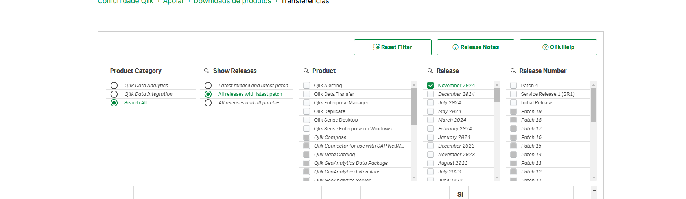

1.4 Depois disso, ir na tabela a baixo e procurar por Qlik_Sense_desktop_setup.exe, é só clicar no link e executar o download:

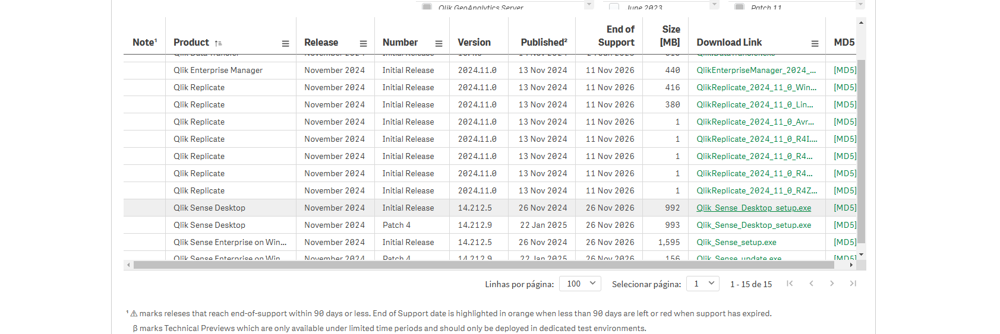

1.5 Depois é necessario baixar o arquivo unlock.jason para que você usar o qlik sense desktop gratuitamente, toda chave tem o prazo de validade, que é necessário atualizar sempre que vencer o prazo. Procure pelo arquivo nas datas no campo **_Release_** o arquivo é chamado de **_Qlik_Sense_Desktop.unlock_** como na imagem:

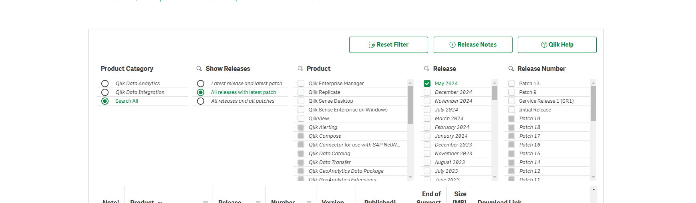

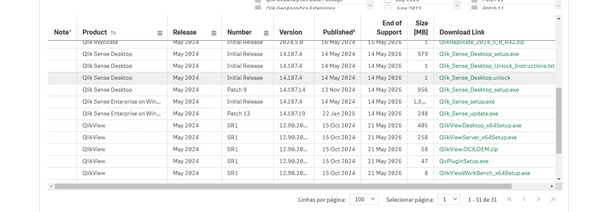

1.6 Depois que o arquivo Unlock estiver baixado, procure o local de destino do download copie e cole na pasta **documents/Qlik/Sense/trial**, sendo trial uma pasta que sera necessario ser criada e então cole o arquivo Unlock la.

1.7 Após fazer tudo isso podera iniciar o Qlik Sense desktop gratuitamente.

**_Incorporar Gráfico de barras Amcharts_**

2. Ok, Agora vamos iniciar a incorporação do gráfico de barras horizontal utilizando uma demo do amcharts através do link:
   <colocar link aqui>

2.1 No Dev-Hub criar uma extensão com o template _table template_, assim que criado exluir partes do código que não sera utilizado:

```javascript
//Retirar a função de criar linhas
function createRows(rows, dimensionInfo) {
  var html = "";
  rows.forEach(function (row) {
    html += "<tr>";
    row.forEach(function (cell, key) {
      if (cell.qIsOtherCell) {
        cell.qText = dimensionInfo[key].othersLabel;
      }
      html += "<td ";
      if (!isNaN(cell.qNum)) {
        html += "class='numeric'";
      }
      html += ">" + cell.qText + "</td>";
    });
    html += "</tr>";
  });
  return html;
}

//Retirar também
var html = "<table><thead><tr>",
  self = this,
  morebutton = false,
  hypercube = layout.qHyperCube,
  rowcount = hypercube.qDataPages[0].qMatrix.length,
  colcount = hypercube.qDimensionInfo.length + hypercube.qMeasureInfo.length;
//render titles
hypercube.qDimensionInfo.forEach(function (cell) {
  html += "<th>" + cell.qFallbackTitle + "</th>";
});
hypercube.qMeasureInfo.forEach(function (cell) {
  html += "<th>" + cell.qFallbackTitle + "</th>";
});
html += "</tr></thead><tbody>";
//render data
html += createRows(hypercube.qDataPages[0].qMatrix, hypercube.qDimensionInfo);
html += "</tbody></table>";
//add 'more...' button
if (hypercube.qSize.qcy > rowcount) {
  html += "<button class='more'>More...</button>";
  morebutton = true;
}
$element.html(html);
if (morebutton) {
  $element.find(".more").on("click", function () {
    var requestPage = [
      {
        qTop: rowcount,
        qLeft: 0,
        qWidth: colcount,
        qHeight: Math.min(50, hypercube.qSize.qcy - rowcount),
      },
    ];
    self.backendApi.getData(requestPage).then(function (dataPages) {
      rowcount += dataPages[0].qMatrix.length;
      if (rowcount >= hypercube.qSize.qcy) {
        $element.find(".more").hide();
      }
      var html = createRows(dataPages[0].qMatrix, hypercube.qDimensionInfo);
      $element.find("tbody").append(html);
    });
  });
}
```

2.2 Na parte de css, pegar as informações do amchart que esta disponivel e copiar para o css da sua extensão, como na imagem:

```css
#chartdiv {
  width: 100%;
  height: 100%;
}
```

2.3 Após isso, importaremos a biblioteca amCharts para nossa extensão. Utilizaremos os links fornecidos pelo gráfico de demonstração, copiando cada biblioteca individualmente. Para isso, abriremos os links no navegador, salvaremos os arquivos .js correspondentes e os incluiremos na nossa extensão.

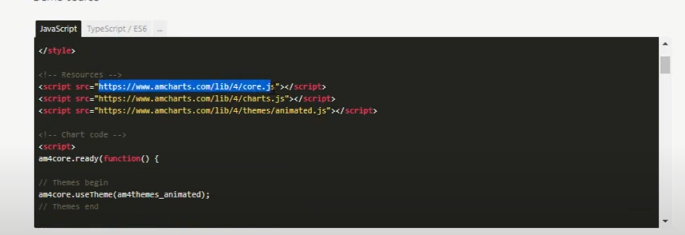

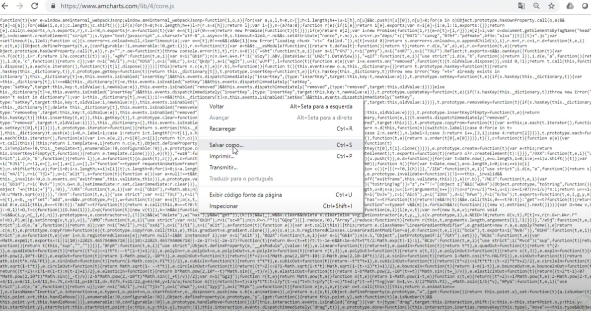

2.4 Depois será necessario configurar o Require.js, na demonstração demo você podera achar o require.js, podemos copia-lo e cola-lo na parte superior do código principal do nosso arquivo .js, teremos que fazer algumas modificações, teremos que passar os 3 arquivos das bibliotecas para que o código possa fazer a leitura deles, e fazer com que esse gráfico apareça na nossa extensão do qlik sense, a baixo estara o código require de como devera ficar nas minhas configurações:

```javascript
//troque o baseUrl para paths como abaixo

require.config({
  paths: {
    index: "/extensions/amColuna/index",
    xy: "/extensions/amColuna/xy",
    Animated: "/extensions/amColuna/Animated",
  },
  shim: {
    "/index": {
      init: function () {
        return window.am5core;
      },
    },
    "/xy": {
      deps: ["index"],
      exports: "xy",
      init: function () {
        return window.am5charts;
      },
    },
    "/Animated": {
      deps: ["index"],
      exports: "Animated",
      init: function () {
        return window.am5themes_Animated;
      },
    },
  },
});

//Perceba que os nomes das paths foram editados para conseguir localizar meus arquivos dentro da minha estrutura, o mesmo foi feito para a propriedade shim

//Aqui sera necessário acrescentar as informações de acordo com a biblioteca

define(["qlik","jquery","text!./style.css","index","xy","Animated",], function (qlik, $, cssContent, index, xy, Animated))


```

2.5 Apartir dai você ja conseguira ver a extensão no Qlik Sense, como na figura a baixo:

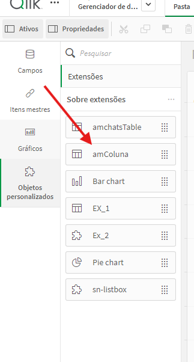

2.6 Com isso então será necessário criar uma div como mostrado no site do amcharts, teremos que criar a conexão para que isso aconteça, iremos trabalhar na seção paint para configurarmos, no paint possuimos dois elementos o $element (são os elementos do html) e o layout (é a parte de dados retornados do qlik) podemos deixar o min de dimension declarada pelo gráfico como 0 por em quanto.

Dimension 0

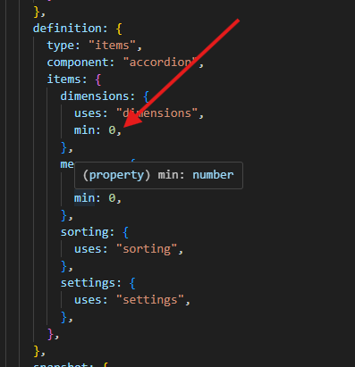

```javascript
//note que nesse trecho do código contemos o $element, layout como falado acima, sera nesse escopo que colocaremos o código que está no demo para renderização do gráfico
 paint: function ($element, layout) {
      var html = '<div id ="chartdiv">Ola Mundo!</div>';
      $element.html(html);
 }
```

Copiar o código que esta na tag script para baixo do conteudo $element.html(html):

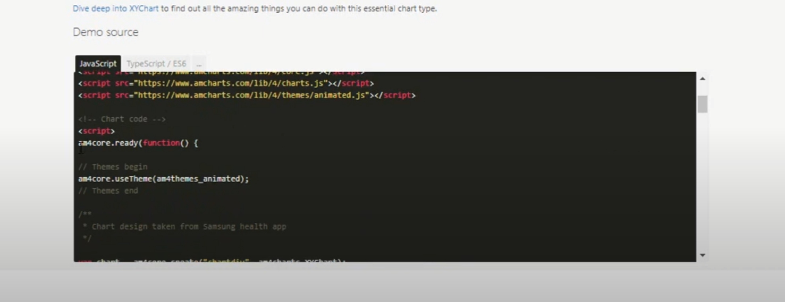

Pronto !! Apartir dai seu gráfico ja estara visivel como extensões no Qlik Sense

    												****<h1>Ponto Importante</h1>*****

O gráfico rederizado no Qlik Sense desktop esta mostrando as informações dos dados do Demo do gráfico, ou seja, possuimos os nomes de Mônica, Joey, Ross... como na figura a baixo:


Para fazer a conexão com as interações do Qlik Sense, precisamos fazer a conexão dos dados da seguinte forma:

Note que os dados esta vindo do seguinte array de objetos:

```javascript
var data = [
  {
    name: "Monica",
    steps: 45688,
    pictureSettings: {
      src: "https://www.amcharts.com/wp-content/uploads/2019/04/monica.jpg",
    },
  },
  {
    name: "Joey",
    steps: 35781,
    pictureSettings: {
      src: "https://www.amcharts.com/wp-content/uploads/2019/04/joey.jpg",
    },
  },
  {
    name: "Ross",
    steps: 25464,
    pictureSettings: {
      src: "https://www.amcharts.com/wp-content/uploads/2019/04/ross.jpg",
    },
  },
  {
    name: "Phoebe",
    steps: 18788,
    pictureSettings: {
      src: "https://www.amcharts.com/wp-content/uploads/2019/04/phoebe.jpg",
    },
  },
  {
    name: "Rachel",
    steps: 15465,
    pictureSettings: {
      src: "https://www.amcharts.com/wp-content/uploads/2019/04/rachel.jpg",
    },
  },
  {
    name: "Chandler",
    steps: 11561,
    pictureSettings: {
      src: "https://www.amcharts.com/wp-content/uploads/2019/04/chandler.jpg",
    },
  },
];
```
Para podermos criar a conexão para inserção de dados atraves do Qlik Sense, precisamos analisar o que há no ***layout*** Para isso a primeiro momento iremos fazer um console.log(layout) para ver no console o que temos dentro do layout:

 Veja que temos todas essas informações:
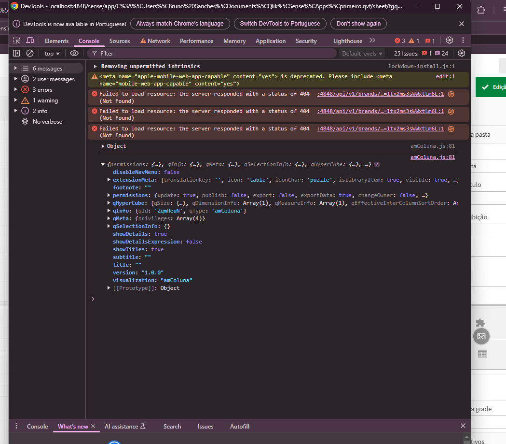


Iremos ter que usar as informações do ***qHyperCube*** em seguida ***qDataPages*** no qDataPages temos um array na posição 0 portanto usaremos ***qDataPages[0]*** seguindo usaremos o ***qMatrix***  o qMatrix possue 4 arrays de informações com dados, nele contem dados que vem do qlik sense das informações, portanto iremos percorrer para esse qMatrix usando o length, ***qMatrix.length***, a imagem a seguir mostra todas as informações disponiveis:

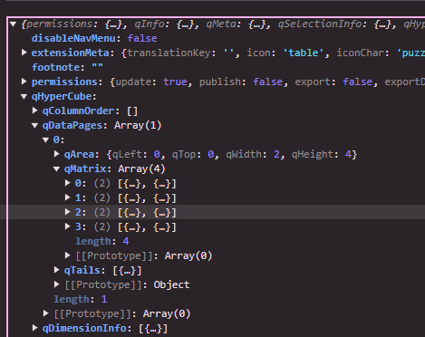

iremos fazer uma variavel para pegar esses valores e colocar dentro do escopo paint a baixo do $element.html(html);: 

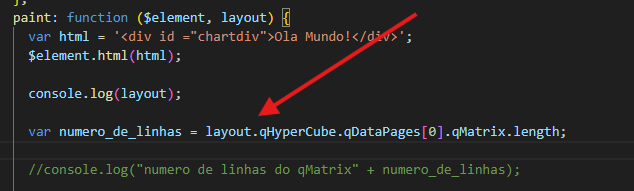

Em seguida iremos utilizar o console.log na variavel para ver quantos arrays aparece no qMatrix, neste caso será o valor 4:

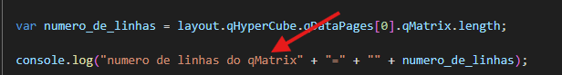

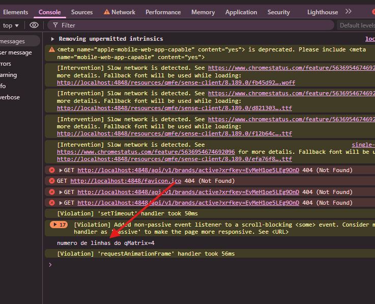

Após realizar isso, iremos criar um variavel de array vazio com o nome de dados, em seguida usaremos uma variavel com o nome c de valor 0 para ser usada no loop for, e iremos preencher essa variavel dados com o metodo push colocando os valores que esta na variavel data logo a cima e iremos trocar os valores dos campos ***name:***, ***steps:***, ***pictureSettings:*** e ***src:*** (caso queira alterar a imagem), os valores nos campos name e steps, serão preenchidos até o caminho final para qText e qNum, nos valores que estão sendo mostrados pelo qHypercube.

```javascript
	var dados = [];
      var c = 0;

      for (c = 0; c < numero_de_linhas; c++) {
        dados.push({
          name: layout.qHyperCube.qDataPages[0].qMatrix[c][0].qText,
          steps: layout.qHyperCube.qDataPages[0].qMatrix[c][1].qNum,
          pictureSettings: {
            src: "https://media.licdn.com/dms/image/v2/D5603AQGOyw0U-nAF0g/profile-displayphoto-shrink_200_200/B56ZSzMhosGQAY-/0/1738173193170?e=1744848000&v=beta&t=uU2iIfYq57Q74PaT-NZgqPY3gOFhxj3FS_8J2Oan1QQ",
          }
        });
      }	
```

Feito isso, os dados do qlik sense ja poderam ser aplicados no Gráfico demo AmCharts

